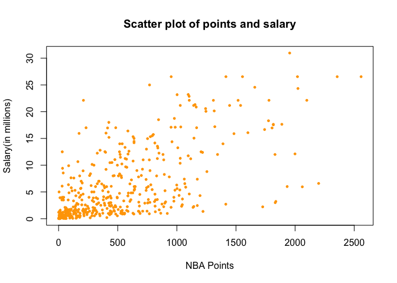
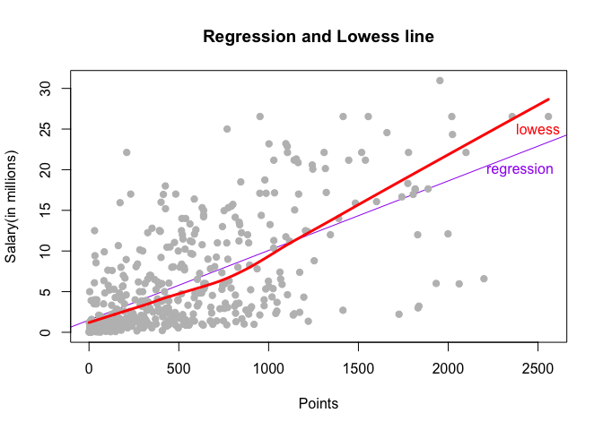
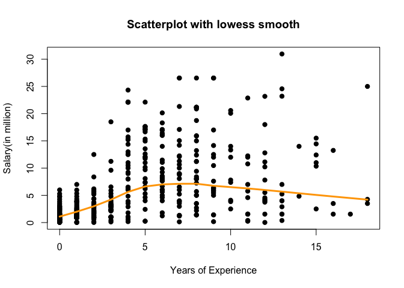
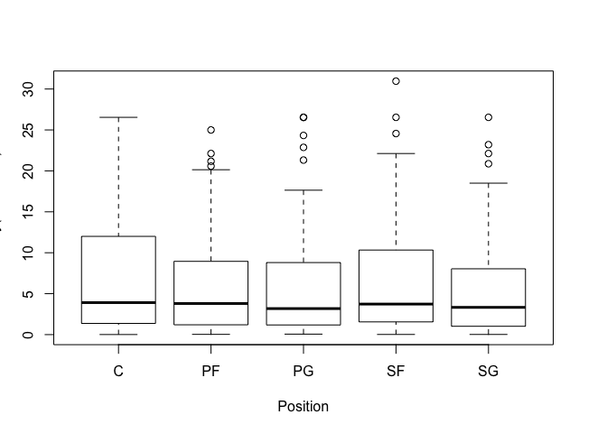

hw01-kexin-wan.rmd
================
kexin wan
2017/9/21

R Markdown
----------

This is an R Markdown document. Markdown is a simple formatting syntax for authoring HTML, PDF, and MS Word documents. For more details on using R Markdown see <http://rmarkdown.rstudio.com>.

When you click the **Knit** button a document will be generated that includes both content as well as the output of any embedded R code chunks within the document. You can embed an R code chunk like this:

``` r
summary(cars)
```

    ##      speed           dist       
    ##  Min.   : 4.0   Min.   :  2.00  
    ##  1st Qu.:12.0   1st Qu.: 26.00  
    ##  Median :15.0   Median : 36.00  
    ##  Mean   :15.4   Mean   : 42.98  
    ##  3rd Qu.:19.0   3rd Qu.: 56.00  
    ##  Max.   :25.0   Max.   :120.00

Including Plots
---------------

You can also embed plots, for example:


Note that the `echo = FALSE` parameter was added to the code chunk to prevent printing of the R code that generated the plot.

#### **1. A bit of data processing**

``` r
install.packages(plyr)
```

``` r
load("data/nba2017-salary-points.RData")
ls()
```

    ## [1] "experience" "player"     "points"     "points1"    "points2"   
    ## [6] "points3"    "position"   "salary"     "team"

``` r
#Create a new salary variable
million_salary <- as.numeric(round(salary/1000000,2),nsmall <-2)
million_salary
```

    ##   [1] 26.54 12.00  8.27  1.45  1.41  6.59  6.29  1.83  4.74  5.00  1.22
    ##  [12]  3.09  3.58  1.91  8.00  7.81  0.02  0.26  0.27  0.01  9.70 12.80
    ##  [23]  1.55  0.54 21.17  5.24 17.64 30.96  2.50 15.33  1.59  7.33  1.58
    ##  [34] 26.54 14.20  0.54  2.70 14.38 12.00  1.92  0.87  5.30  1.20  6.05
    ##  [45] 12.25  3.73 22.12  1.20  1.19  0.54 15.94  5.00 16.96 12.00  7.40
    ##  [56]  5.89  0.54  2.87  3.39  1.50  2.71 23.18  8.40  0.39 15.73  4.00
    ##  [67]  2.50  4.84  1.02 20.07  0.42  3.85  2.28  3.00 17.10  5.37  1.55
    ##  [78] 12.52 15.20  0.92  9.61  1.40 10.50  1.81  6.35  2.57  2.37  2.70
    ##  [89] 10.23  4.58  0.65  8.80  1.05  1.80  4.00  4.00 10.77  2.46 18.31
    ## [100]  1.05 14.15  3.49  1.45  2.11  0.87  2.09 23.20  1.02  1.64 17.55
    ## [111]  1.71  3.18  5.78  0.75 14.00 13.22  2.90 15.89 22.12  4.00  5.78
    ## [122]  0.87  2.59  1.23  0.21  0.54  5.63  4.00  6.00  1.02 22.12  6.50
    ## [133]  1.55  7.00  0.87  1.70  6.00 10.99  3.68  4.62  0.65  2.26 14.96
    ## [144]  2.97 17.20  1.05  0.10  0.87  5.32  2.73  6.51  0.16 12.00  6.33
    ## [155] 12.25 13.00 12.50 20.87  6.00  0.54 24.56  0.14 11.24 21.32 17.00
    ## [166]  1.02  4.32  3.90  6.19  0.54  0.54  2.90  0.54  1.41  1.38  4.35
    ## [177] 17.00  5.00  7.25  0.98  2.61 17.00 15.00  6.54  0.03  3.91 11.75
    ## [188]  0.03  0.95 10.00  0.03  2.32  9.00  4.79  9.42  4.83  1.51  2.99
    ## [199]  1.03  1.02  8.00  0.09  0.87  8.55  1.33  6.09  0.12 21.17  1.56
    ## [210]  1.07 11.48  0.98  3.00  3.33  1.79  2.50  1.40  0.98  0.73  9.25
    ## [221] 11.13  1.17  1.55 15.33  1.02  0.98  1.40 26.54  1.18 16.66  0.38
    ## [232]  0.54  5.78 12.11  2.90  0.54 10.00  1.55  0.54  1.18  2.90  0.17
    ## [243]  0.87 17.64  1.19 20.58 14.00  3.58 15.50 14.45  0.68  0.54  1.30
    ## [254] 12.39  0.26 26.54  0.54  7.00  1.00  6.00 18.74  1.72  7.81  0.15
    ## [265]  1.32 11.00 20.14  1.55  1.27 22.87 21.17  0.54  7.38 13.25  2.20
    ## [276]  1.40  3.50  1.55  5.63 10.15  7.00  3.94 11.05  8.00 16.07  1.02
    ## [287]  2.25 11.00  0.60  0.94  1.41  2.12  2.43  2.34  5.99  2.18  2.44
    ## [298]  2.48 17.15  0.98  1.19  4.84  3.75  0.25 26.54  0.54  3.14  8.95
    ## [309]  6.55  0.94  5.70 22.12  1.37  2.90  0.98  1.29 21.17 26.54  5.51
    ## [320]  3.33  4.26  1.79  0.08 10.36  7.68 18.50  3.22 24.33  6.67 16.39
    ## [331]  0.60  1.92  8.99  9.21  2.75  0.87  1.35  0.54 15.05  8.07  3.24
    ## [342]  1.66  3.21  4.54  1.99 12.08  1.63  2.33  3.50  1.36  5.00  3.53
    ## [353] 11.20  4.60 22.12  0.02  0.54  2.98 16.96  0.58  8.08  0.17 11.29
    ## [364]  9.90  0.06 11.24  2.09  0.65  1.02  4.23 25.00  0.54  8.38 22.12
    ## [375]  4.10  0.06  4.38  0.54  0.87  2.90 17.10  0.21  8.00 12.50  4.01
    ## [386]  3.52  5.23  8.00  2.20  8.05  5.20  1.44 13.33  1.19  1.32 10.66
    ## [397]  3.55  2.02  6.01  3.50  7.64  2.35  3.91  5.96  3.87  3.80  0.14
    ## [408] 13.55  3.05  1.34  2.24  5.28  7.60  5.33  0.07  1.03 12.50  3.27
    ## [419]  1.21 18.00  1.55  5.44  6.19  1.05 16.00  1.73  0.87  4.82 12.61
    ## [430]  0.54  2.22  4.28  0.02 14.00 10.47  4.00  2.94  0.28  2.13  0.92
    ## [441] 12.41

``` r
#Create a new experience variable
replace = replace(experience,experience=="R","0")
experience_new <- as.integer(replace)
experience_new
```

    ##   [1]  9 11  6  0  9  5  4  2  0  6  1  3  2  1  4 10 12 11  5  1  5 12 13
    ##  [24]  0  8 13  5 13 15  5  2  5  1  7  7  0  0  4 10  2  1  5  0  6  7  2
    ##  [47]  4  7  1  0  8  8  6  9  5  3  0  0  3  0  3 12  8 11  4 12  0 14  3
    ##  [70] 10  3 10  3  3  6  2 17  4  4  0  3  8  4  1  9  0  3  8 12 11  0  7
    ##  [93]  1  6  6  5 11  1  6  1  9  8  1  1  1  0 13  3  1  5  2  3  2  0 10
    ## [116]  8  4  8  4  7  9  1  1  6  0  0  2 13  7  1  4  4 12  1  1  0  6  5
    ## [139]  3  5  0  3  5  1  5  4  1  1  3  1  4  2  5  9 11  4  4  8  9  0 13
    ## [162]  0  8  7  9  3  1  4  5  0  0  0  0  9  0  2  5  9  8  2  2  4  8  7
    ## [185]  0  1  5  0  0  4  0  0  7  1  8  0  1  2  1  3  4  0  1  6  0  4  3
    ## [208]  8  0  0  6  2  2  2  4 10  1  2  2  6 12  0 13  4  3  2  8  9  1  5
    ## [231] 13  0 11  7 13  0  7 11  0  0  3  9  1  5  2 10 14  7 15 15  2  0  2
    ## [254]  8  0  7  0 11  1  4  8  1 12  0  7  4  6 11  0 11  8  0 10 16  8  8
    ## [277] 18 11  6  5 13  1  6  8  6  3  2 15  0  1  2  3  5  1  0  3  0  2  5
    ## [300]  2  1  4 12  5  8  0  3  7  3  0  8  5  0  2  2  1  8  9 12  3 18  0
    ## [323]  0 15  6  3  3  4  6  6  0  2  4  4  2  1  2  0  7  7  1  2  0 12  0
    ## [346]  5  0  3 16  1  8  4  8  6  4  1  0  7  6  4  5  4  7  6  0  3  2  0
    ## [369]  3 12 18  0  2  4 10  0  2  0  1  3  7  0  8  9  3  0  7  6  0  8  2
    ## [392]  0 10  0  7  7  1  2  2  8  6  3  7  1  0  1  7  5  3  1  2  0  9  1
    ## [415]  0  0  2  2  1 12 16  9  2  4  6  2  1  3  5  0  1  0  2  6  9 13  0
    ## [438] 11  2  0 15

``` r
#Create a new position variable
position_new <- as.factor(position)
position_new
```

    ##   [1] C  PF SG PG SF PG SF SG SF PF PF C  SG PG C  C  SF PG PF C  SG SG SF
    ##  [24] PG PF SG PG SF SF C  SF SG PG SG SF PG C  C  PG C  SG SF PF PF PF SF
    ##  [47] SG PG PF C  C  C  PG C  PF SF SG SG PG SF PG C  PF PG SF PF PG SF C 
    ##  [70] PF PF SF SG SF C  PF SG C  SF SG PG PF PF SG PF C  SG PG C  SF PF PG
    ##  [93] PG PF SG PF SG C  SF PF PF SG PF PG C  SG SG SG PG SF C  PG PF SF PG
    ## [116] C  SG PG C  PF PF SG SF SF PF SG PG C  SG C  C  C  PG C  SG PF PG PF
    ## [139] SG SF SG SF PG SF PF PG PG PF PF C  SG PF PG SG PF SF C  SG PG SG SF
    ## [162] PG SG PG C  SG PF C  PF C  PF SF SG SG C  SF C  PG PG SF PG SG PF SG
    ## [185] SG SF C  SG C  SF PF PF SG C  PG C  SF SG C  SF PG C  PG C  SF PF SG
    ## [208] C  SF PG PG SG C  SF PF SG SF SG PG PF SF C  C  PF SG PF C  SF C  SG
    ## [231] SF SG PG PG C  SG SG PF PF PG C  C  SG SF SG PF SG PG C  PG PG C  C 
    ## [254] SG PG PG PF SG C  SG PF SF SF SF SF SG PF PF PF PG C  C  SG SG SF C 
    ## [277] SF PG SF SG PF PG PF PG SF C  SF SF PF PG SG C  PG PF SG SF PF SF C 
    ## [300] SF PF SF PF PG PG PG C  PF SG PG PF SF C  SF PF PF C  PG SG SG SF PG
    ## [323] SG PF SF SG SG PG PF SF SF C  SF PF PF SG PG SG SF PF PG SG SG PG PF
    ## [346] PF SG C  SF C  C  SG SF C  C  SF PF SF C  PF SG SG PG C  PG SF PG C 
    ## [369] SG PG PF PF C  PF PG PF C  SF C  PG SG PG PF SG SG SG PG SG C  C  PG
    ## [392] SG SF PF PG SF C  PF SF SG C  PF C  C  PG PF SF PG SF PG SG SF SF PG
    ## [415] SG C  SG PF PF SF SF SG C  PF C  PG C  C  SG SF SG PF SG PG PF SG PF
    ## [438] PG SF PG C 
    ## Levels: C PF PG SF SG

``` r
#Create more descriptive labels
library(plyr)
position_updated <- mapvalues(position_new,from=c("C","SF","PF","SG","PG"),to=c("center","small_fwd","power_fwd","shoot_guard","point_guard"))
position_updated
```

    ##   [1] center      power_fwd   shoot_guard point_guard small_fwd  
    ##   [6] point_guard small_fwd   shoot_guard small_fwd   power_fwd  
    ##  [11] power_fwd   center      shoot_guard point_guard center     
    ##  [16] center      small_fwd   point_guard power_fwd   center     
    ##  [21] shoot_guard shoot_guard small_fwd   point_guard power_fwd  
    ##  [26] shoot_guard point_guard small_fwd   small_fwd   center     
    ##  [31] small_fwd   shoot_guard point_guard shoot_guard small_fwd  
    ##  [36] point_guard center      center      point_guard center     
    ##  [41] shoot_guard small_fwd   power_fwd   power_fwd   power_fwd  
    ##  [46] small_fwd   shoot_guard point_guard power_fwd   center     
    ##  [51] center      center      point_guard center      power_fwd  
    ##  [56] small_fwd   shoot_guard shoot_guard point_guard small_fwd  
    ##  [61] point_guard center      power_fwd   point_guard small_fwd  
    ##  [66] power_fwd   point_guard small_fwd   center      power_fwd  
    ##  [71] power_fwd   small_fwd   shoot_guard small_fwd   center     
    ##  [76] power_fwd   shoot_guard center      small_fwd   shoot_guard
    ##  [81] point_guard power_fwd   power_fwd   shoot_guard power_fwd  
    ##  [86] center      shoot_guard point_guard center      small_fwd  
    ##  [91] power_fwd   point_guard point_guard power_fwd   shoot_guard
    ##  [96] power_fwd   shoot_guard center      small_fwd   power_fwd  
    ## [101] power_fwd   shoot_guard power_fwd   point_guard center     
    ## [106] shoot_guard shoot_guard shoot_guard point_guard small_fwd  
    ## [111] center      point_guard power_fwd   small_fwd   point_guard
    ## [116] center      shoot_guard point_guard center      power_fwd  
    ## [121] power_fwd   shoot_guard small_fwd   small_fwd   power_fwd  
    ## [126] shoot_guard point_guard center      shoot_guard center     
    ## [131] center      center      point_guard center      shoot_guard
    ## [136] power_fwd   point_guard power_fwd   shoot_guard small_fwd  
    ## [141] shoot_guard small_fwd   point_guard small_fwd   power_fwd  
    ## [146] point_guard point_guard power_fwd   power_fwd   center     
    ## [151] shoot_guard power_fwd   point_guard shoot_guard power_fwd  
    ## [156] small_fwd   center      shoot_guard point_guard shoot_guard
    ## [161] small_fwd   point_guard shoot_guard point_guard center     
    ## [166] shoot_guard power_fwd   center      power_fwd   center     
    ## [171] power_fwd   small_fwd   shoot_guard shoot_guard center     
    ## [176] small_fwd   center      point_guard point_guard small_fwd  
    ## [181] point_guard shoot_guard power_fwd   shoot_guard shoot_guard
    ## [186] small_fwd   center      shoot_guard center      small_fwd  
    ## [191] power_fwd   power_fwd   shoot_guard center      point_guard
    ## [196] center      small_fwd   shoot_guard center      small_fwd  
    ## [201] point_guard center      point_guard center      small_fwd  
    ## [206] power_fwd   shoot_guard center      small_fwd   point_guard
    ## [211] point_guard shoot_guard center      small_fwd   power_fwd  
    ## [216] shoot_guard small_fwd   shoot_guard point_guard power_fwd  
    ## [221] small_fwd   center      center      power_fwd   shoot_guard
    ## [226] power_fwd   center      small_fwd   center      shoot_guard
    ## [231] small_fwd   shoot_guard point_guard point_guard center     
    ## [236] shoot_guard shoot_guard power_fwd   power_fwd   point_guard
    ## [241] center      center      shoot_guard small_fwd   shoot_guard
    ## [246] power_fwd   shoot_guard point_guard center      point_guard
    ## [251] point_guard center      center      shoot_guard point_guard
    ## [256] point_guard power_fwd   shoot_guard center      shoot_guard
    ## [261] power_fwd   small_fwd   small_fwd   small_fwd   small_fwd  
    ## [266] shoot_guard power_fwd   power_fwd   power_fwd   point_guard
    ## [271] center      center      shoot_guard shoot_guard small_fwd  
    ## [276] center      small_fwd   point_guard small_fwd   shoot_guard
    ## [281] power_fwd   point_guard power_fwd   point_guard small_fwd  
    ## [286] center      small_fwd   small_fwd   power_fwd   point_guard
    ## [291] shoot_guard center      point_guard power_fwd   shoot_guard
    ## [296] small_fwd   power_fwd   small_fwd   center      small_fwd  
    ## [301] power_fwd   small_fwd   power_fwd   point_guard point_guard
    ## [306] point_guard center      power_fwd   shoot_guard point_guard
    ## [311] power_fwd   small_fwd   center      small_fwd   power_fwd  
    ## [316] power_fwd   center      point_guard shoot_guard shoot_guard
    ## [321] small_fwd   point_guard shoot_guard power_fwd   small_fwd  
    ## [326] shoot_guard shoot_guard point_guard power_fwd   small_fwd  
    ## [331] small_fwd   center      small_fwd   power_fwd   power_fwd  
    ## [336] shoot_guard point_guard shoot_guard small_fwd   power_fwd  
    ## [341] point_guard shoot_guard shoot_guard point_guard power_fwd  
    ## [346] power_fwd   shoot_guard center      small_fwd   center     
    ## [351] center      shoot_guard small_fwd   center      center     
    ## [356] small_fwd   power_fwd   small_fwd   center      power_fwd  
    ## [361] shoot_guard shoot_guard point_guard center      point_guard
    ## [366] small_fwd   point_guard center      shoot_guard point_guard
    ## [371] power_fwd   power_fwd   center      power_fwd   point_guard
    ## [376] power_fwd   center      small_fwd   center      point_guard
    ## [381] shoot_guard point_guard power_fwd   shoot_guard shoot_guard
    ## [386] shoot_guard point_guard shoot_guard center      center     
    ## [391] point_guard shoot_guard small_fwd   power_fwd   point_guard
    ## [396] small_fwd   center      power_fwd   small_fwd   shoot_guard
    ## [401] center      power_fwd   center      center      point_guard
    ## [406] power_fwd   small_fwd   point_guard small_fwd   point_guard
    ## [411] shoot_guard small_fwd   small_fwd   point_guard shoot_guard
    ## [416] center      shoot_guard power_fwd   power_fwd   small_fwd  
    ## [421] small_fwd   shoot_guard center      power_fwd   center     
    ## [426] point_guard center      center      shoot_guard small_fwd  
    ## [431] shoot_guard power_fwd   shoot_guard point_guard power_fwd  
    ## [436] shoot_guard power_fwd   point_guard small_fwd   point_guard
    ## [441] center     
    ## Levels: center power_fwd point_guard small_fwd shoot_guard

``` r
#The frequency of each position
table(position_updated)
```

    ## position_updated
    ##      center   power_fwd point_guard   small_fwd shoot_guard 
    ##          89          89          85          83          95

#### **2. Scatterplot of Points and Salary**

``` r
plot(points,million_salary,pch=19, col="orange",cex=0.5,xlab="NBA Points",ylab="Salary(in millions)",main="Scatter plot of points and salary")
```



#### **A concise description of the pattern **

There is a **positive linear relationship** existing between **points** and **salary**. That is, as the points for the player increases, his salary generally increases as well. However, there are still some **outliers** with high NBA points but relatively low salary.

#### **3. Correlation between points and salary**

``` r
#number of individuals
n <- length(points)
n
```

    ## [1] 441

``` r
#mean of variable x
x_average <- sum(points)/n
x_average
```

    ## [1] 546.6054

``` r
#mean of variable y
y_average <- sum(million_salary)/n
y_average
```

    ## [1] 6.186689

``` r
#variance of x
var_x <- sum((points-x_average)^2)/(n-1)
var_x
```

    ## [1] 239136.2

``` r
#variance of y
var_y <-  sum((points-y_average)^2)/(n-1)
var_y
```

    ## [1] 531852.4

``` r
#standard deviation of x
sd_x <-  sqrt(var_x)
sd_x
```

    ## [1] 489.0156

``` r
#standard deviation of y
sd_y <-  sqrt(var_y)
sd_y
```

    ## [1] 729.2821

``` r
#covariance between x and y
cov_x_y <-  sum((points-x_average)*(million_salary-y_average))/(n-1)
cov_x_y
```

    ## [1] 2046.424

``` r
#correlation between x and y
cor_x_y <-  cov_x_y/(sd_x*sd_y)
cor_x_y
```

    ## [1] 0.005738223

#### **4. Simple Linear Regression**

``` r
# the slope term b1
b1 <- cor_x_y*sd_y/sd_x
b1
```

    ## [1] 0.008557567

``` r
#b0 the intercept
b0 <- y_average-b1*x_average
b0
```

    ## [1] 1.509077

``` r
#the vector of predicted values
y_hat <- b0+b1*(points)

#A summary of y_hat
summary(y_hat)
```

    ##    Min. 1st Qu.  Median    Mean 3rd Qu.    Max. 
    ##   1.509   2.844   5.206   6.187   8.184  23.399

#### Summary statistics of y\_hat

    * minimum is 6.134
    * first quartile is 6.181
    * median is 6.186
    * mean is 6.199
    * third quartile is 6.187
    * maximum is 6.969

#### Regression Equation

The regression line is `y_hat = 1.509077+0.008557567*(points)`

#### intepretation of b1

The slope coefficient b1 tells the amount of change in salary(y) that can be expected to result from a unit increase in points(x)

#### intepretation of b0

The intercept term b0 tells the amount of expected mean salary for a player when his points is 0.

#### predicted salary for players

    * predicted salary for 0 points is 1.509077 million dollars
    * predicted salary for 100 points is 2.364833 million dollars
    * predicted salary for 500 points is 5.78786 million dollars
    * predicted salary for 1000 points is 10.06664 million dollars
    * predicted salary for 2000 points is 18.62421 million dollars

#### **5. Plotting the regression line**

``` r
plot(points,million_salary,main="Regression and Lowess line",xlab="Points",ylab="Salary(in millions)",col="gray",pch=19,abline(a=1.509077, b=0.008557567, lwd=1, col="purple"))
lines(lowess(points,million_salary),col="red",lwd=3)
text(x=c(2400,2500),y=c(20,25),labels=c("regression","lowess"),col=c("purple","red"))
```



#### \*\*6. Regression residuals and Coefficient of Determination R2

``` r
#The vector of residuals
e = million_salary - y_hat
summary(e) 
```

    ##    Min. 1st Qu.  Median    Mean 3rd Qu.    Max. 
    ## -14.187  -2.792  -1.095   0.000   2.556  18.814

``` r
#The residual sum of squares
RSS=sum(e^2)
RSS
```

    ## [1] 11300.45

``` r
#The total sum of square
TSS=sum((million_salary-mean(million_salary))^2)
TSS
```

    ## [1] 19005.91

``` r
#The coefficient of determination
R_2= 1-RSS/TSS
R_2
```

    ## [1] 0.4054246

#### **7. Exploring Position and Experience**

``` r
#A scatterplot of Years_of_Experience and Salary
plot(experience_new,million_salary,main="Scatterplot with lowess smooth",xlab="Years of Experience",ylab="Salary(in million)",col="black",pch=19)
lines(lowess(experience_new,million_salary),col="orange",lwd=3)
```



``` r
#3D scatterplot of Points,Experience, and Salary
# install.packages("scatterplot3d")
library(scatterplot3d)
scatterplot3d<-scatterplot3d(points,experience_new,million_salary,color="orange", pch=19,main="3D Scatterplot",xlab="points",ylab="salary",zlab="experience")
```


``` r
#A conditional boxplot of salary in terms of position
boxplot(million_salary ~ position_new, xlab="Position",ylab="Salary(in millions)")
```



#### Concise description of the plot

    The scatterplot shows the relationship between years of experience and salary. From the scatterplot there is no apparent correlation between years of experience and salary. 
    The 3D scatterplot shows the relationship between points and salary, points and experience, and salary and experience.
    From the 3D boxplot we can see that the first quartile and median salary for each position is roughly the same. But the third quartile salary and the highest salary for each position is somewhat different.

#### Scatterplot comprehension

    The scatterplot shows no linears pattern. Instead, in small range of years of experience the salary in this range also varies widely, showing a vertical line pattern at each range of years of experience. Therefore, from the scatterplot, the experience seem to be unrelated with salary.

#### Boxplot comprehension

    From the box plot the position seem to be related with salary sincet the third quartile and the highest salaries in each position is different (even though the median seems roughly the same).

#### **Comments and Reflections**

    * What things were hard, even though you saw them in class?
      1. THe manipulation of the various plot, the specific parameters inside them always confuse me, I have to constantly serach for help() to understand what these parameters mean. 
      2. The concept of vectorization.
      
    * What was easy even though we haven't done in class?
      1. install packages
      2. the various arithmetic operation
      
    * If this was the first time you were using git, how do you feel about it?
      I don't feel quite familiar with using it and hope can make progress by practicing more.
      
    * If this was the first time using GitHub, how do you feel about it?
      It's covenient.
      
    * Did you need help to complete the assignment? If so, what kind of help? who help you?
      There's a lot of basic syntax I feel I have no idea about how to use and is not covered in the class/lab/tutorial. I search for help through google and but a textbook myself to study.
      
    * What was the most time consuming part?
      I spent a lot of time figuring out how to use the function line and lowess. Usually it's the syntax, the various application of the function part that I am the most struggling with.
     
    * How much time did it take to complete the HW?
      I would say about 4-5 hours.
      
    * Was there anything you don't understand? or fully grasped?
      The syntax of lowess and line.

    * Was there anything frustrating in particular?
      I have no previous experience in R and find that I have not much resources to look into when I get stucked with some particular function since it is not covered in the class.

    * Was there anything exciting? Something that you feel proud of?
      I find it really exciting when I was able to make the scatterplot, the boxplot through programming.
