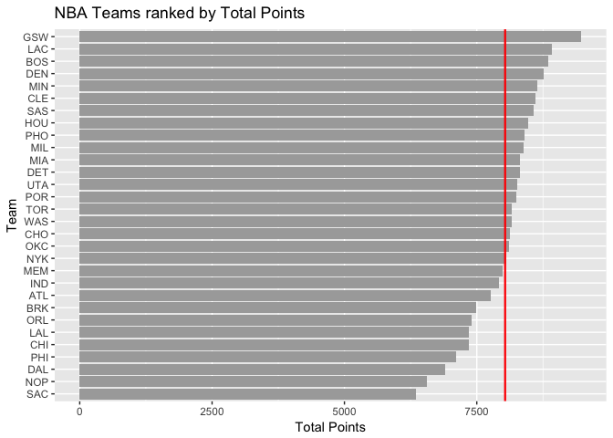

hw03-Kexin-Wan.Rmd
================
kexin wan
2017/10/14

R Markdown
----------

This is an R Markdown document. Markdown is a simple formatting syntax for authoring HTML, PDF, and MS Word documents. For more details on using R Markdown see <http://rmarkdown.rstudio.com>.

When you click the **Knit** button a document will be generated that includes both content as well as the output of any embedded R code chunks within the document. You can embed an R code chunk like this:

``` r
summary(cars)
```

    ##      speed           dist       
    ##  Min.   : 4.0   Min.   :  2.00  
    ##  1st Qu.:12.0   1st Qu.: 26.00  
    ##  Median :15.0   Median : 36.00  
    ##  Mean   :15.4   Mean   : 42.98  
    ##  3rd Qu.:19.0   3rd Qu.: 56.00  
    ##  Max.   :25.0   Max.   :120.00

Including Plots
---------------

You can also embed plots, for example:


Note that the `echo = FALSE` parameter was added to the code chunk to prevent printing of the R code that generated the plot.

``` r
install.packages("ggplot2")
install.packages("dplyr")
```

    ## Warning: package 'dplyr' was built under R version 3.4.2

    ## 
    ## Attaching package: 'dplyr'

    ## The following objects are masked from 'package:stats':
    ## 
    ##     filter, lag

    ## The following objects are masked from 'package:base':
    ## 
    ##     intersect, setdiff, setequal, union

    ##      team             experience         salary          points3      
    ##  Length:30          Min.   : 34.00   Min.   : 55.78   Min.   : 513.0  
    ##  Class :character   1st Qu.: 56.00   1st Qu.: 84.58   1st Qu.: 617.0  
    ##  Mode  :character   Median : 63.00   Median : 91.41   Median : 704.0  
    ##                     Mean   : 68.73   Mean   : 90.94   Mean   : 730.7  
    ##                     3rd Qu.: 73.25   3rd Qu.:101.86   3rd Qu.: 805.8  
    ##                     Max.   :128.00   Max.   :125.80   Max.   :1141.0  
    ##      point2      free_throws       points      off_rebounds  
    ##  Min.   :1769   Min.   : 998   Min.   :6348   Min.   :524.0  
    ##  1st Qu.:2115   1st Qu.:1238   1st Qu.:7561   1st Qu.:699.2  
    ##  Median :2252   Median :1384   Median :8164   Median :762.5  
    ##  Mean   :2242   Mean   :1359   Mean   :8035   Mean   :768.7  
    ##  3rd Qu.:2413   3rd Qu.:1492   3rd Qu.:8452   3rd Qu.:865.8  
    ##  Max.   :2638   Max.   :1605   Max.   :9473   Max.   :961.0  
    ##   def_rebounds     assists         steals          blocks     
    ##  Min.   :1878   Min.   :1291   Min.   :475.0   Min.   :234.0  
    ##  1st Qu.:2435   1st Qu.:1546   1st Qu.:544.8   1st Qu.:311.0  
    ##  Median :2536   Median :1738   Median :590.0   Median :351.5  
    ##  Mean   :2524   Mean   :1732   Mean   :583.3   Mean   :360.3  
    ##  3rd Qu.:2644   3rd Qu.:1858   3rd Qu.:612.0   3rd Qu.:389.5  
    ##  Max.   :2854   Max.   :2475   Max.   :779.0   Max.   :551.0  
    ##    turnovers          fouls        efficiency   
    ##  Min.   : 703.0   Min.   :1164   Min.   :125.1  
    ##  1st Qu.: 973.5   1st Qu.:1355   1st Qu.:143.8  
    ##  Median :1021.5   Median :1519   Median :146.7  
    ##  Mean   :1013.5   Mean   :1496   Mean   :149.0  
    ##  3rd Qu.:1087.2   3rd Qu.:1599   3rd Qu.:152.9  
    ##  Max.   :1184.0   Max.   :1886   Max.   :177.9

    ## quartz_off_screen 
    ##                 2

    ## Saving 7 x 5 in image

``` r
#NBA Teams ranked by total salary
library(ggplot2)
ggplot(teams, aes(x=reorder(team, salary), y=salary)) +
  coord_flip() +
  geom_bar(stat='identity',fill="dark grey") +
  ggtitle("NBA Teams ranked by Total Salary") +
  geom_hline(aes(yintercept=mean(salary),color="red", size=0.05)) + labs(x="Team",y="Salary(in millions)")
```


``` r
#NBA Teams ranked by Total Points
ggplot(teams,aes(x= reorder(team,points),y=points)) + geom_bar(stat="identity",fill="dark grey") + coord_flip() + ggtitle("NBA Teams ranked by Total Points") + geom_hline(aes(yintercept=mean(points)),color="red",size=0.8) + labs(x="Team",y="Total Points")
```



``` r
#NBA Teams ranked by Total Efficiency
ggplot(teams,aes(x=reorder(team,efficiency),y=efficiency)) + geom_bar(stat="identity",color="light grey") + coord_flip() + geom_hline(yintercept=mean(teams$efficiency),color="red",size=0.8) + ggtitle("NBA Teams ranked by Total Efficiency") + labs(x="Team",y="Total Efficiency")
```


``` r
#Principle Component Analysis
pca = prcomp(teams[c("points3", "point2", "free_throws", "off_rebounds", "def_rebounds", "assists","steals", "blocks", "turnovers", "fouls")], scale = TRUE)
pca
```

    ## Standard deviations (1, .., p=10):
    ##  [1] 2.1669994 1.3046111 0.9897094 0.8784756 0.7308134 0.6913872 0.6182263
    ##  [8] 0.5101592 0.3655034 0.2503921
    ## 
    ## Rotation (n x k) = (10 x 10):
    ##                    PC1         PC2         PC3          PC4         PC5
    ## points3      0.1121782 -0.65652993  0.28806873 -0.042637313  0.28657624
    ## point2       0.3601766  0.32892544 -0.06763180 -0.347710703 -0.15173866
    ## free_throws  0.3227564 -0.17651228  0.39157491  0.147596178 -0.21363792
    ## off_rebounds 0.3029366  0.35931603  0.33884845 -0.288483019 -0.16571824
    ## def_rebounds 0.3719432 -0.12808273  0.15026131 -0.492969442  0.26476256
    ## assists      0.3125312 -0.44134618 -0.26294129 -0.088066602 -0.36972525
    ## steals       0.3447256 -0.03540585 -0.48554101  0.177578661 -0.33549491
    ## blocks       0.3162237  0.06131890 -0.48869371  0.003935374  0.65459381
    ## turnovers    0.3353958 -0.02169833  0.08910421  0.532117541 -0.04471763
    ## fouls        0.3072548  0.28954426  0.26469871  0.454751471  0.26814214
    ##                       PC6         PC7         PC8         PC9         PC10
    ## points3      -0.028435666  0.38167878  0.18027569 -0.20631322  0.409762462
    ## point2       -0.088714347  0.07302430 -0.47216199 -0.35836740  0.499011524
    ## free_throws  -0.487342521 -0.62732220  0.07726675 -0.08283563 -0.006875686
    ## off_rebounds  0.283093235  0.13535335  0.64646479 -0.14735551 -0.124601143
    ## def_rebounds  0.066309015 -0.04926346 -0.23787252  0.64632050 -0.168579984
    ## assists       0.176019008  0.11785039 -0.18235775 -0.34086739 -0.547385461
    ## steals       -0.303664534  0.25883825  0.32703573  0.41596580  0.246739300
    ## blocks       -0.009954065 -0.30799231  0.23947533 -0.27071160 -0.057627209
    ## turnovers     0.675777660 -0.18850849 -0.14308362  0.13524769  0.250947823
    ## fouls        -0.298848473  0.47268121 -0.21462859 -0.04367200 -0.335087245

``` r
names(pca)
```

    ## [1] "sdev"     "rotation" "center"   "scale"    "x"

``` r
eigs <- data.frame(eigenvalue = pca$sdev^2,proportion = round(pca$sdev^2/sum(pca$sdev^2),4))
eigs <- data.frame(eigs,cumprop = round(cumsum(eigs$proportion),4))

#Use the first two PCs to get a scatterplot
PC1 <- pca$x[,1]
PC2 <- pca$x[,2]
helper_frame <- data.frame(PC1 = PC1, PC2 = PC2)
ggplot(data=helper_frame,aes(x=PC1,y=PC2)) + geom_point() + geom_text(label=teams$team) + geom_hline(aes(yintercept=0)) + geom_vline(aes(xintercept=0))
```


``` r
#Index based on PC1
z1 <- PC1
min_z1 <- min(PC1)
max_z1 <- max(PC1)
s1 <- 100*((z1-min_z1)/(max_z1-min_z1))
teams <- cbind(teams,s1)

#Produce a barchart like the previous one
z1_bar <- ggplot(data=teams,aes(x=reorder(team,s1),y=s1)) + geom_bar(stat="identity",alpha=0.5) + coord_flip() + ggtitle("NBA Teams ranked by scaled PC1") + labs(x="Team",y="First PC(scaled from 0 to 100)")
z1_bar
```


### Comments and Reflections

1.  Was this your first time working on a project with such file structure? If yes, how do you feel about it?

Yes. It's really difficult to manage so many concepts and functions. But it's definitely worth trying.

1.  Was this your first time using relative paths? If yes, can you tell why they are important for reproducibility purposes?

Yes.

1.  Was this your first time using an R script? If yes, what do you think about just writing code?

No. It's not that flexible as Rmd.

1.  What things were hard, even though you saw them in class/lab?

To understand the concept of principal component analysis and use them in R functions.

1.  What was easy(-ish) even though we haven???t done it in class/lab?

It's really easy to perform the arithmetic calculation.

1.  Did anyone help you completing the assignment? If so, who?

No.

1.  How much time did it take to complete this HW?

Around 6 hours.

1.  What was the most time consuming part?

Understanding how to use R to perform principal component analysis.

9.Was there anything interesting?

Not really.
